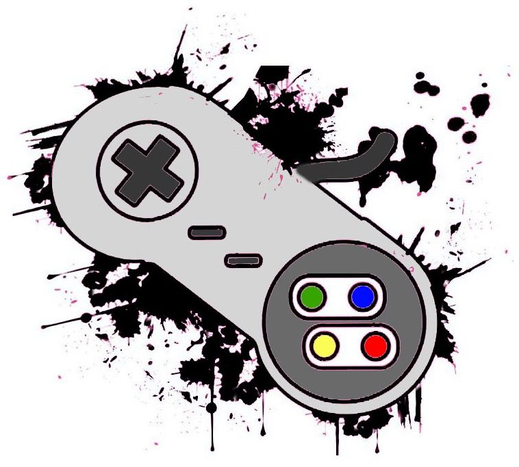

# server-reprogramafy-games
 Repositório para fazer a entrega da Reprograma na semana 8.

## Reprogramafy

    API feita para praticar o verbo GET em uma lista de músicas no formato JSON. 

## Games 

    Entrega da semana 8 que consiste em uma API que utiliza o verbo GET para retornar todos os jogos da lista e também retornar os jogos específicos quando digitado o seu ID na URL.  
**A descrição detalhada se encontra dentro da pasta espécifica de cada projeto!**
